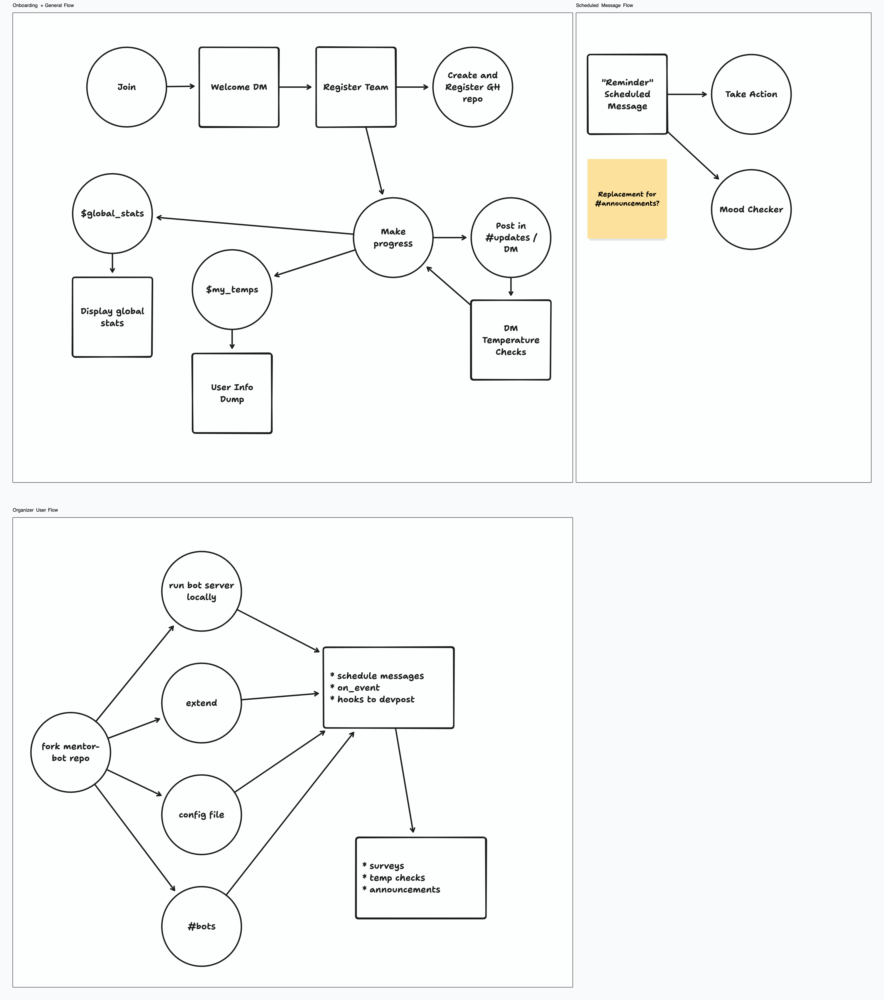

# hackathon-mentor-bot
A mentor bot to advise hackathon attendees and support organizers for use in (Discord)

The goal of this bot is to help both the attendees and organizers keep track of their learning and progress during a hackathon.

## Installation

(NOTE: This bot is not yet publically usable)

```python
pip install -r requirements.txt
```

Follow the directions on the [discordpy](https://discordpy.readthedocs.io/en/stable/discord.html#discord-intro) documentation to create a bot and add it to your server.

## Features

\* = Not yet implemented

Organizers can:
- Schedule DMs to attendees based on username or role
    - Can be single or recurring
    - Can be used for announcements, reminders, or check-ins

Hackers can:
- *Register their teams and GitHub repositorie for tracking
- Post in the #update channel to share progress
    - This triggers a check-in DM from the bot
- Check global stats of the hackathon (currently a dummy file)

Temperature check-in is based on John Hunter in World Peace And Other 4th-Grade Achievements Harper Collins 2014 ISBN 9780544290037

It asks the user 4 questions: 
- Rate your function (i.e. your progress, solution, answer, etc) on a scale from 1-10
- Rate the elegance or beauty of your function or thinking on a scale from 1-10
- Rate your effort on a scale from 1-10
- List the sources you used to help you learn or solve the problem

## User Flow


[User Flow Diagram](https://www.tldraw.com/s/v2_c_mIoelW-FkU6DonizF8qRQ?d=v230.-740.3166.1844.u3uTLtOXOF0gz0ZSLETkT)